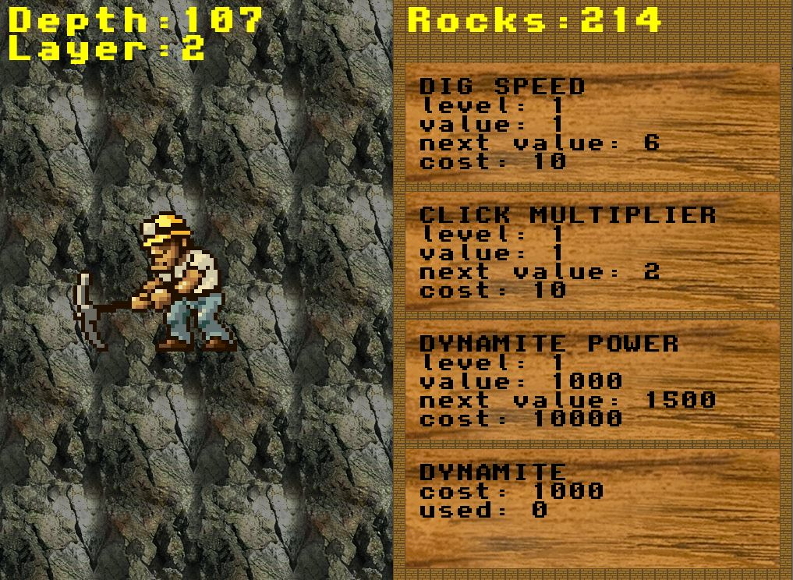

# Chasm
The goal of the game is to dig as deep as possible.\
Player can dig deeper by either waiting for the miner to dig something out or by clicking on him.\
Alongside with gaining depth player earns rock - the in-game currency.\
There are 3 improvements to spend it on:
- dig speed - miner digs faster on his own (improves passive income)
- click multiplier - each click gives rocks multiplied by this factor (improves active income)
- dynamite power - defines how much depth player gains if they buy a dynamite (no rock is earned)

## Demo

